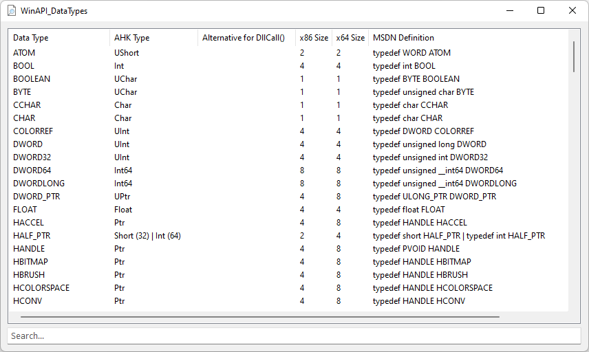
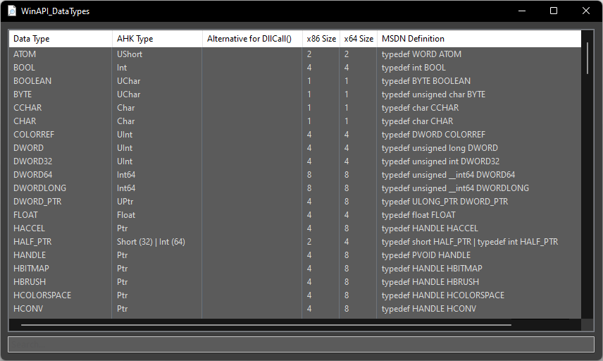

# Windows Data Types for AutoHotkey

Translated MSDN Types for DllCall's in AutoHotkey

## Examples

## Contributing
* special thanks to just me and TheArkive

## Questions / Bugs / Issues
If you notice any kind of bugs or issues, report them on the [AHK Thread](https://www.autohotkey.com/boards/viewtopic.php?t=99817). Same for any kind of questions.

## Copyright and License

## Donations
