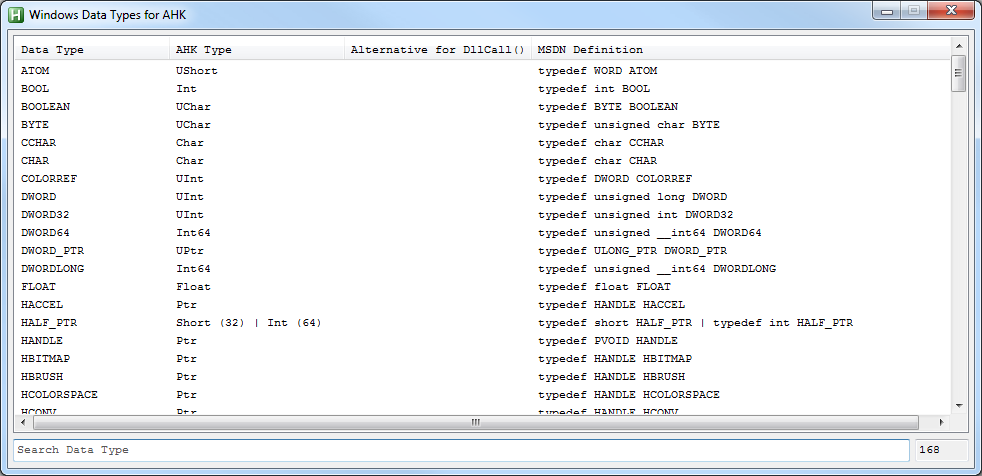

# Windows Data Types for AutoHotkey
Translated MSDN Types for DllCall's in AutoHotkey

  
## Features
### Offline Version
* Pro: Faster than the online version
* Con: Must be updated manually

### Online Version
* Pro: Downloaded every time the latest translation
* Con: Slower than the offline version

## Screenshots
### After start

### After search something

## Info
* Version: v0.2
* URL: [AHK Thread](http://ahkscript.org/boards/viewtopic.php?f=6&t=7342)

## Changelog
* 0.2 | Small fixes
* 0.1 | First Release

## Contributing
* special thanks to just me
* thanks to AutoHotkey Community

## Copyright and License
[Unlicense](LICENSE)